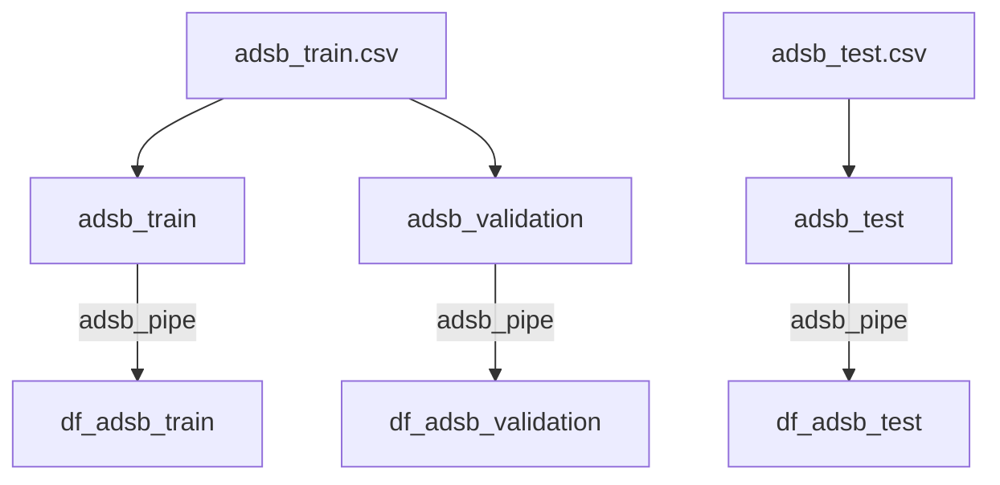

# icarus

```mermaid
graph TD
    A[adsb_train.csv] --> B[adsb_train]
    A --> C[adsb_validation]
    E[adsb_test.csv] --> F[adsb_test]
    B -->|adsb_pipe| G[df_adsb_train]
    C -->|adsb_pipe| H[df_adsb_validation]
    F -->|adsb_pipe| I[df_adsb_test]


```

